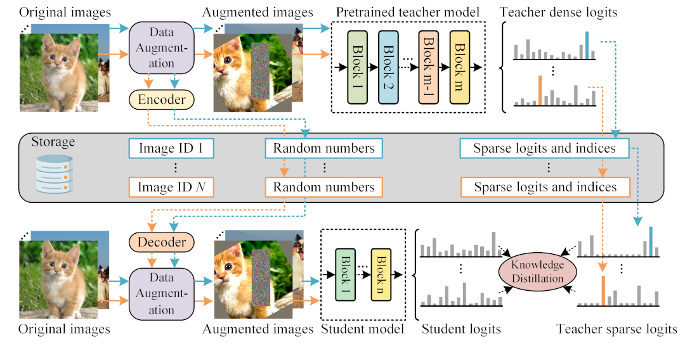
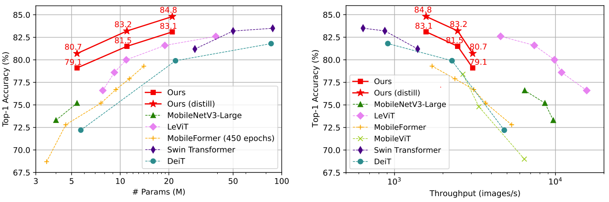

# TinyViT Model Zoo

Thanks for your attention to our work : )

It is the model zoo about the ECCV 2022 paper: TinyViT: Fast Pretraining Distillation for Small Vision Transformers

We release **the code** in the project [microsoft/Cream](https://github.com/microsoft/Cream/tree/main/TinyViT)

TinyViT is a new family of tiny and efficient vision transformers pretrained on large-scale datasets with our proposed fast distillation framework. The central idea is to transfer knowledge from large pretrained models to small ones, while enabling small models to get the dividends of massive pretraining data. More specifically, we apply distillation during pretraining for knowledge transfer. The logits of large teacher models are sparsified and stored in disk in advance to save the memory cost and computation overheads.

    

## Highlights

    

* 1. A fast pretraining distillation framework to unleash the capacity of small models by fully leveraging the large-scale pretraining data.
* 2. A new family of tiny vision transformer models, striking a good trade-off between computation and accuracy.
